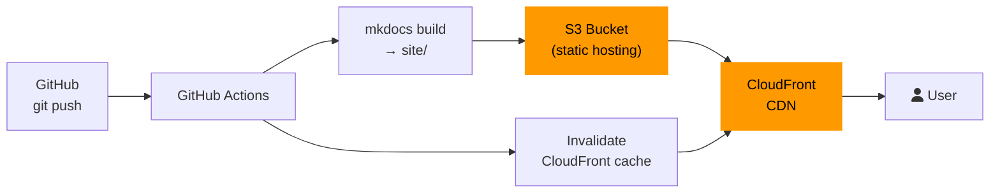

---
tags:
  - Deployment
  - AWS
  - Cloud
---

# AWS — S3 + CloudFront

Deploy MkDocs to **Amazon S3** for static hosting with **CloudFront** as the global CDN. Suitable for enterprise deployments requiring fine-grained access control, custom caching, and geographic restrictions.

---

## Architecture



---

## Prerequisites

- AWS account with permissions to create S3 buckets and CloudFront distributions
- IAM user or role with the policies below

## IAM Policy

Create an IAM user with this policy (or use OIDC federation — recommended):

```json title="iam-policy.json"
{
  "Version": "2012-10-17",
  "Statement": [
    {
      "Effect": "Allow",
      "Action": ["s3:PutObject", "s3:DeleteObject", "s3:ListBucket"],
      "Resource": [
        "arn:aws:s3:::YOUR-BUCKET-NAME",
        "arn:aws:s3:::YOUR-BUCKET-NAME/*"
      ]
    },
    {
      "Effect": "Allow",
      "Action": ["cloudfront:CreateInvalidation"],
      "Resource": "arn:aws:cloudfront::ACCOUNT-ID:distribution/DISTRIBUTION-ID"
    }
  ]
}
```

!!! tip "Use OIDC instead of IAM keys"
    Configure [GitHub OIDC federation](https://docs.github.com/en/actions/security-for-github-actions/security-hardening-your-deployments/configuring-openid-connect-in-amazon-web-services) to avoid storing long-lived credentials as secrets.

---

## S3 Bucket Setup

```bash
# Create bucket
aws s3api create-bucket \
  --bucket YOUR-BUCKET-NAME \
  --region us-east-1

# Enable static website hosting
aws s3api put-bucket-website \
  --bucket YOUR-BUCKET-NAME \
  --website-configuration '{
    "IndexDocument": {"Suffix": "index.html"},
    "ErrorDocument": {"Key": "404.html"}
  }'

# Block public access (serve through CloudFront only)
aws s3api put-public-access-block \
  --bucket YOUR-BUCKET-NAME \
  --public-access-block-configuration \
    "BlockPublicAcls=true,IgnorePublicAcls=true,\
     BlockPublicPolicy=true,RestrictPublicBuckets=true"
```

---

## GitHub Actions Workflow

```yaml title=".github/workflows/deploy-aws.yml"
name: Deploy to AWS S3 + CloudFront

on:
  push:
    branches: [main]

permissions:
  contents: read
  id-token: write       # Required for OIDC authentication

jobs:
  deploy:
    runs-on: ubuntu-latest

    steps:
      - uses: actions/checkout@v4
        with:
          fetch-depth: 0

      - uses: actions/setup-python@v5
        with:
          python-version: '3.x'

      - name: Install and build
        run: |
          pip install -r requirements.txt
          mkdocs build

      - name: Configure AWS credentials (OIDC)
        uses: aws-actions/configure-aws-credentials@v4
        with:
          role-to-assume: ${{ secrets.AWS_ROLE_ARN }}
          aws-region: ${{ secrets.AWS_REGION }}

      - name: Sync to S3
        run: |
          aws s3 sync site/ s3://${{ secrets.AWS_S3_BUCKET }}/ \
            --delete \
            --cache-control "public, max-age=3600"

      - name: Invalidate CloudFront cache
        run: |
          aws cloudfront create-invalidation \
            --distribution-id ${{ secrets.CLOUDFRONT_DISTRIBUTION_ID }} \
            --paths "/*"
```

---

## Required Secrets

| Secret | Description |
|---|---|
| `AWS_ROLE_ARN` | IAM role ARN for OIDC federation |
| `AWS_REGION` | AWS region (e.g. `us-east-1`) |
| `AWS_S3_BUCKET` | S3 bucket name (without `s3://`) |
| `CLOUDFRONT_DISTRIBUTION_ID` | CloudFront distribution ID |

---

## Manual Deploy (Without CI)

```bash
pip install -r requirements.txt
mkdocs build

# Sync to S3
aws s3 sync site/ s3://YOUR-BUCKET-NAME/ --delete

# Invalidate cache
aws cloudfront create-invalidation \
  --distribution-id YOUR-DIST-ID \
  --paths "/*"
```

---

## Cost Estimate

For a typical docs site (< 100 MB, < 10,000 monthly visitors):

| Service | Estimated monthly cost |
|---|---|
| S3 storage (100 MB) | ~$0.002 |
| S3 requests | ~$0.01 |
| CloudFront (10 GB transfer) | ~$0.85 |
| **Total** | **< $1/month** |

!!! info "Free tier"
    New AWS accounts get 12 months of free tier including 5 GB S3 storage and 50 GB CloudFront data transfer.
