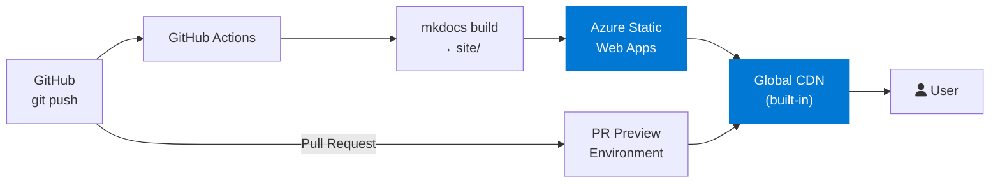

---
tags:
  - Deployment
  - Azure
  - Cloud
---

# Azure Static Web Apps

Deploy MkDocs to **Azure Static Web Apps** — Microsoft's managed global CDN with free SSL, automatic PR preview environments, and a generous free tier.

---

## Architecture



!!! success "PR Preview Environments"
    Azure Static Web Apps automatically deploys a preview URL for every open PR — great for doc review.

---

## Prerequisites

- Azure subscription (free tier available at [azure.com/free](https://azure.com/free))
- Azure CLI or Azure Portal access

## Create the Static Web App

=== "Azure Portal"
    1. Go to [portal.azure.com](https://portal.azure.com)
    2. Search for **Static Web Apps** → **Create**
    3. Select your subscription and resource group
    4. **Deployment details:** choose **GitHub**
    5. Authorise GitHub → select your repo and `main` branch
    6. **Build preset:** Custom
    7. **App location:** `/`
    8. **Output location:** `site`  ← **Important**
    9. Click **Review + create**

=== "Azure CLI"
    ```bash
    az login

    az staticwebapp create \
      --name mkdocs-demo \
      --resource-group my-rg \
      --source https://github.com/12shubham/mkdocs-demo \
      --location "West Europe" \
      --branch main \
      --app-location "/" \
      --output-location "site" \
      --login-with-github
    ```

---

## GitHub Actions Workflow

When you create the Static Web App via the Portal or CLI, Azure auto-generates a workflow file. Here is the complete version for an MkDocs site:

```yaml title=".github/workflows/deploy-azure.yml"
name: Deploy to Azure Static Web Apps

on:
  push:
    branches: [main]
  pull_request:
    types: [opened, synchronize, reopened, closed]
    branches: [main]

jobs:
  build_and_deploy:
    if: >
      github.event_name == 'push' ||
      (github.event_name == 'pull_request' &&
       github.event.action != 'closed')
    runs-on: ubuntu-latest

    steps:
      - uses: actions/checkout@v4
        with:
          fetch-depth: 0

      - uses: actions/setup-python@v5
        with:
          python-version: '3.x'

      - name: Build MkDocs
        run: |
          pip install -r requirements.txt
          mkdocs build

      - name: Deploy to Azure Static Web Apps
        uses: Azure/static-web-apps-deploy@v1
        with:
          azure_static_web_apps_api_token: ${{ secrets.AZURE_STATIC_WEB_APPS_API_TOKEN }}
          repo_token: ${{ secrets.GITHUB_TOKEN }}
          action: upload
          app_location: /          # Repo root
          output_location: site    # mkdocs build output
          skip_app_build: true     # We already built above

  close_pr_environment:
    if: >
      github.event_name == 'pull_request' &&
      github.event.action == 'closed'
    runs-on: ubuntu-latest

    steps:
      - name: Close PR environment
        uses: Azure/static-web-apps-deploy@v1
        with:
          azure_static_web_apps_api_token: ${{ secrets.AZURE_STATIC_WEB_APPS_API_TOKEN }}
          action: close
```

---

## Required Secrets

| Secret | How to get it |
|---|---|
| `AZURE_STATIC_WEB_APPS_API_TOKEN` | Automatically added by Azure Portal. Or run: `az staticwebapp secrets list --name <app-name>` |

---

## Custom Domain

```bash
az staticwebapp hostname set \
  --name mkdocs-demo \
  --resource-group my-rg \
  --hostname docs.mycompany.com
```

Then add a `CNAME` DNS record pointing `docs.mycompany.com` → the default hostname shown in the Azure Portal.

---

## Manual Deploy (Without CI)

```bash
# Install Azure Static Web Apps CLI
npm install -g @azure/static-web-apps-cli

pip install -r requirements.txt
mkdocs build

# Deploy from local machine
swa deploy site/ \
  --deployment-token YOUR-DEPLOYMENT-TOKEN \
  --env production
```

---

## Cost Estimate

| Plan | Cost | Limits |
|---|---|---|
| **Free** | $0/month | 100 GB/month bandwidth, 0.5 GB storage |
| **Standard** | $9/month | 100 GB/month included, custom auth, SLA |

Most documentation sites fit comfortably within the free tier.
