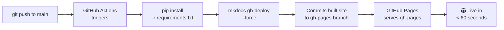

---
tags:
  - Deployment
  - GitHub
---

# GitHub Pages

:fontawesome-brands-github: **Live site:** [https://12shubham.github.io/mkdocs-demo](https://12shubham.github.io/mkdocs-demo)

GitHub Pages is the simplest deployment option — zero cost, zero infrastructure, and the workflow is already included in this repository.

---

## How It Works



`mkdocs gh-deploy` is a built-in MkDocs command that builds the site and force-pushes the output to the `gh-pages` branch. GitHub Pages serves that branch automatically.

---

## The Workflow File

```yaml title=".github/workflows/deploy.yml"
name: Deploy MkDocs to GitHub Pages

on:
  push:
    branches:
      - main          # triggers on every push to main

permissions:
  contents: write     # needed to push to gh-pages branch

jobs:
  deploy:
    runs-on: ubuntu-latest

    steps:
      - name: Checkout repository
        uses: actions/checkout@v4
        with:
          fetch-depth: 0      # (1)

      - name: Set up Python
        uses: actions/setup-python@v5
        with:
          python-version: '3.x'

      - name: Install dependencies
        run: pip install -r requirements.txt

      - name: Deploy to GitHub Pages
        run: mkdocs gh-deploy --force
```

1. `fetch-depth: 0` fetches the full Git history — required if you use the `git-revision-date-localized` plugin.

---

## First-Time Setup

=== "Step 1 — Enable GitHub Pages"
    1. Go to your repository on GitHub
    2. Navigate to **Settings → Pages**
    3. Under **Source**, select **Deploy from a branch**
    4. Select branch: **`gh-pages`** / folder: **`/ (root)`**
    5. Click **Save**

=== "Step 2 — Push to main"
    ```bash
    git add .
    git commit -m "feat: initial docs site"
    git push origin main
    ```
    The Actions workflow runs automatically. Check progress under the **Actions** tab.

=== "Step 3 — Verify"
    After the workflow completes (~30–60 s), visit:
    ```
    https://<your-username>.github.io/<your-repo-name>/
    ```

---

## Custom Domain

```yaml title="docs/CNAME"
docs.mycompany.com
```

Add a `CNAME` file to `docs/` containing your domain. Then configure DNS:

| Record type | Name | Value |
|---|---|---|
| `CNAME` | `docs` | `<username>.github.io` |

Then in **Settings → Pages → Custom domain**, enter your domain and enable **Enforce HTTPS**.

---

## Branch Protection (Recommended)

Protect `main` so docs always go through PR review:

1. **Settings → Branches → Add branch protection rule**
2. Pattern: `main`
3. Enable: :material-check: Require a pull request before merging
4. Enable: :material-check: Require status checks to pass

---

## Required Secrets

None — GitHub Actions has built-in `GITHUB_TOKEN` with `contents: write` permission.

---

!!! success "Already configured"
    This repository has the workflow file at `.github/workflows/deploy.yml` and is ready to deploy. Just push to `main`.
