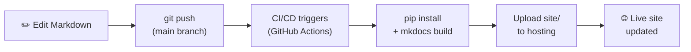

---
tags:
  - Deployment
  - Overview
---

# Deployment Overview

This framework supports four deployment targets. Only **GitHub Pages** has a live sample site running — the other three include production-ready pipeline configs you can drop into your project.

---

## At a Glance

<div class="grid cards" markdown>

-   :fontawesome-brands-github:{ .lg .middle } **GitHub Pages**

    ---
    Zero-cost static hosting, auto-deployed via GitHub Actions.  
    **Live site:** [12shubham.github.io/mkdocs-demo](https://12shubham.github.io/mkdocs-demo)

    [:octicons-arrow-right-24: Setup guide](github.md)

-   :fontawesome-brands-aws:{ .lg .middle } **AWS**

    ---
    S3 static hosting + CloudFront CDN. Enterprise-grade, globally distributed.

    [:octicons-arrow-right-24: Setup guide](aws.md)

-   :simple-microsoftazure:{ .lg .middle } **Azure**

    ---
    Azure Static Web Apps — managed global CDN, free SSL, preview environments.

    [:octicons-arrow-right-24: Setup guide](azure.md)

-   :fontawesome-brands-google:{ .lg .middle } **GCP**

    ---
    Google Cloud Storage + Cloud CDN or Firebase Hosting.

    [:octicons-arrow-right-24: Setup guide](gcp.md)

</div>

---

## How Every Deploy Works

Regardless of cloud provider, the pattern is the same:



1. **Write** — edit any `.md` file
2. **Push** — `git push origin main`
3. **Build** — `mkdocs build` creates the `site/` folder
4. **Upload** — pipeline uploads `site/` to the chosen provider
5. **Live** — changes are visible in under 60 seconds

---

## Choosing a Provider

| Factor | GitHub Pages | AWS | Azure | GCP |
|---|:---:|:---:|:---:|:---:|
| Cost (basic) | Free | $~0.03/GB | Free tier | Free tier |
| Custom domain | ✅ | ✅ | ✅ | ✅ |
| Free SSL | ✅ | ✅ | ✅ | ✅ |
| Global CDN | ❌ | ✅ CloudFront | ✅ | ✅ |
| PR previews | ❌ | ❌ | ✅ | ❌ |
| Auth / private | ❌ | ✅ CloudFront | ✅ | ✅ |
| Setup effort | Low | Medium | Low | Medium |

---

## Secret Management

All pipelines use **GitHub Actions Secrets** for credentials. Never commit keys to the repository.

```bash
# Add a secret in GitHub
# Settings → Secrets and variables → Actions → New repository secret
```

Required secrets per provider are documented on each provider's page.
