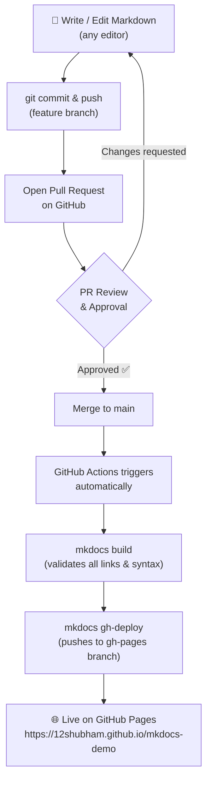

# The Docs as Code Workflow

This page walks through the **end-to-end lifecycle** of a documentation change — from writing to publishing — using the same Git workflow used for code.

---

## The Full Lifecycle



---

## Step-by-Step: Making a Doc Change

### 1. Create a Branch

Always work on a feature branch — never commit docs directly to `main`.

```bash
git checkout -b docs/update-api-reference
```

### 2. Write in Markdown

Edit or create `.md` files in the `docs/` folder. Use `mkdocs serve` to preview locally:

```bash
mkdocs serve
# Open http://127.0.0.1:8000 — hot-reloads on every save
```

!!! tip "Live Preview During Demo"
    Run `mkdocs serve` in a terminal, open the browser, then edit a `.md` file. The browser updates instantly — no manual refresh needed.

### 3. Commit and Push

```bash
git add docs/
git commit -m "docs: update API reference for v2 endpoints"
git push origin docs/update-api-reference
```

### 4. Open a Pull Request

Open a PR on GitHub. Your team can now:

- Leave **inline comments** on specific lines of Markdown
- Suggest edits directly in the GitHub UI
- Approve or request changes — just like code review

!!! note "Docs Review Checklist"
    - [ ] Is the content accurate and up to date?
    - [ ] Are code examples correct and tested?
    - [ ] Are all internal links working?
    - [ ] Is the tone consistent with the rest of the docs?

### 5. Merge → Auto Deploy

Once the PR is approved and merged to `main`, GitHub Actions takes over:

```yaml title=".github/workflows/deploy.yml"
on:
  push:
    branches:
      - main      # ← triggers on every merge to main

jobs:
  deploy:
    runs-on: ubuntu-latest
    steps:
      - uses: actions/checkout@v4
      - uses: actions/setup-python@v5
      - run: pip install -r requirements.txt
      - run: mkdocs gh-deploy --force   # ← builds + deploys in one command
```

The site is live in **under 60 seconds** after merge.

---

## Folder Structure Convention

```
mkdocs-demo/
├── mkdocs.yml              ← Single config file for the entire site
├── requirements.txt        ← Pinned doc dependencies (reproducible builds)
├── docs/
│   ├── index.md            ← Home page
│   ├── docs-as-code/
│   │   ├── index.md        ← Concept overview
│   │   └── workflow.md     ← This page
│   ├── getting-started/
│   │   ├── installation.md
│   │   └── configuration.md
│   ├── api-reference.md
│   └── changelog.md
└── .github/
    └── workflows/
        └── deploy.yml      ← CI/CD pipeline for auto-deploy
```

!!! success "Convention: Docs Live Next to Code"
    Keep `docs/` in the **same repository** as your source code. When a developer changes an API, updating the docs is part of the same PR — enforced by code review.

---

## Branching Strategy for Docs

| Branch Pattern | Purpose |
|---|---|
| `main` | Published docs (always deployed) |
| `docs/topic-name` | New doc page or section |
| `fix/typo-in-readme` | Quick corrections |
| `feature/new-feature` | Docs written alongside the feature code |

**[← What is Docs as Code?](index.md)** | **[Get Started →](../getting-started/installation.md)**
