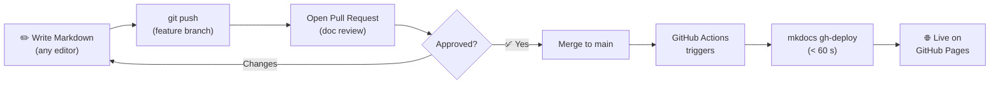

---
tags:
  - Framework
  - Getting Started
---

# Framework Overview

This repository is a **ready-to-fork MkDocs starter** that gives you every Material feature pre-configured and a working CI/CD pipeline out of the box. Clone it, rename the site, add your content, and push — that's it.

---

## Project Structure

```
mkdocs-demo/
│
├── mkdocs.yml                  ← Single source of truth for the entire site
├── requirements.txt            ← Pinned dependencies (reproducible builds)
├── .gitignore                  ← Excludes site/ and __pycache__
│
├── .github/
│   └── workflows/
│       └── deploy.yml          ← Auto-deploy to GitHub Pages on every push
│
├── includes/
│   └── abbreviations.md        ← Global abbreviations (appended to every page)
│
└── docs/
    ├── index.md                ← Home page
    ├── tags.md                 ← Auto-generated tag index
    ├── assets/
    │   └── extra.css           ← Brand colours & custom styles
    ├── javascripts/
    │   └── mermaid-config.js   ← Mermaid brand-colour initialisation
    ├── framework/              ← ← You are here
    │   ├── index.md
    │   ├── components.md
    │   └── new-page.md
    ├── deployment/
    │   ├── index.md
    │   ├── github.md
    │   ├── aws.md
    │   ├── azure.md
    │   └── gcp.md
    └── showcase/
        ├── index.md
        ├── admonitions.md
        ├── code-blocks.md
        ├── diagrams.md
        └── components.md
```

---

## Key Files Explained

| File | What it controls |
|---|---|
| `mkdocs.yml` | Site name, nav, theme, plugins, extensions — everything |
| `requirements.txt` | Pinned Python packages — ensures identical builds everywhere |
| `docs/assets/extra.css` | Brand colours mapped to Material CSS variables |
| `docs/javascripts/mermaid-config.js` | Mermaid initialised with brand palette |
| `includes/abbreviations.md` | Terms like *CI/CD*, *IaC*, *SLO* get hover tooltips on **every** page |
| `.github/workflows/deploy.yml` | GitHub Actions pipeline — triggers on push to `main` |

---

## Three-Step Workflow



---

## Customising the Site

### 1 — Change site name & URL

```yaml title="mkdocs.yml"
site_name: My Project Docs          # (1)
site_url: https://myorg.github.io/my-repo
repo_url: https://github.com/myorg/my-repo
```

1. This appears in the browser tab and the header.

### 2 — Update brand colours

```css title="docs/assets/extra.css"
[data-md-color-scheme="default"] {
  --md-primary-fg-color:  #FD5108;   /* header & links */
  --md-accent-fg-color:   #FD5108;   /* hover & active */
}
```

### 3 — Add a new section to the nav

```yaml title="mkdocs.yml"
nav:
  - Home: index.md
  - My New Section:                  # (1)
      - Overview: my-section/index.md
      - Deep Dive: my-section/detail.md
```

1. The section header links to `my-section/index.md` thanks to `navigation.indexes`.

---

## What Each Plugin Does

| Plugin | Purpose | Enabled |
|---|---|---|
| `search` | Full-text search with autocomplete | ✅ |
| `tags` | Tag pages and render a tag index | ✅ |
| `minify` | Minify HTML for faster page loads | ✅ |
| `git-revision-date-localized` | Show "Last updated" on pages | Optional |
| `social` | Auto-generate social preview cards | Optional (Insiders) |
| `offline` | Bundle site for offline viewing | Optional (Insiders) |

---

[All Components →](components.md){ .md-button .md-button--primary }
[Creating New Pages →](new-page.md){ .md-button }
