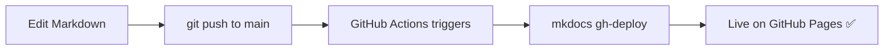

# Welcome to MkDocs Demo

!!! success "Live Demo"
    This site was built with **MkDocs + Material theme** and deployed automatically to GitHub Pages via GitHub Actions.  
    Every `git push` to `main` triggers a new deployment — usually live in under 60 seconds.

---

## What is MkDocs?

[MkDocs](https://www.mkdocs.org/) is a fast, simple, and beautiful static site generator designed specifically for project documentation. Source files are written in **Markdown** and configured with a single **YAML** file.

## Why Material for MkDocs?

The [Material theme](https://squidfunk.github.io/mkdocs-material/) is the most popular MkDocs theme. It gives you:

| Feature | Description |
|---|---|
| :material-palette: Dark/Light mode | Toggle between themes |
| :material-magnify: Instant search | Full-text search across all pages |
| :material-navigation: Navigation tabs | Clean top-level navigation |
| :material-code-tags: Code highlighting | Syntax highlighting with copy button |
| :material-responsive: Responsive | Looks great on mobile |

## Key Features Shown in This Demo

=== "Navigation"
    - Top-level **tabs** for major sections
    - Left sidebar for sub-pages
    - "Back to top" button

=== "Search"
    - Click the search bar (or press `/`) and try searching for any term on this site

=== "Code Blocks"
    ```python title="hello.py"
    def greet(name: str) -> str:
        return f"Hello, {name}!"

    print(greet("MkDocs"))
    ```

=== "Admonitions"
    !!! tip "Pro Tip"
        Admonitions are a great way to highlight important information.

    !!! warning "Watch Out"
        This is a warning block — useful for caveats and gotchas.

---

## How the Deploy Works



**[Get Started →](getting-started/installation.md)**
