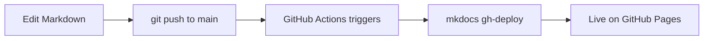

---
hide:
  - toc
tags:
  - DevOps
  - Overview
---

<div class="hero-strip" markdown>

# :material-infinity: DevOps Documentation Framework

**Document every phase of your pipeline as code.**  
Plain Markdown · Git-versioned · PR-reviewed · Auto-deployed · Always current.

[Get Started](framework/index.md){ .md-button .md-button--primary }
[All Features](showcase/index.md){ .md-button }
[Deploy Now](deployment/index.md){ .md-button }

</div>

---

## The Eight-Phase DevOps Lifecycle

```mermaid
graph LR
    PLAN["📋 Plan"]
    CODE["💻 Code"]
    BUILD["🔨 Build"]
    TEST["🧪 Test"]
    RELEASE["📦 Release"]
    DEPLOY["🚀 Deploy"]
    OPERATE["⚙️ Operate"]
    MONITOR["📊 Monitor"]

    PLAN    --> CODE
    CODE    --> BUILD
    BUILD   --> TEST
    TEST    --> RELEASE
    RELEASE --> DEPLOY
    DEPLOY  --> OPERATE
    OPERATE --> MONITOR
    MONITOR -.->|Continuous Feedback| PLAN

    style PLAN    fill:#FD5108,stroke:#FD5108,color:#fff
    style CODE    fill:#FE7C39,stroke:#FE7C39,color:#fff
    style BUILD   fill:#FFAA72,stroke:#FFAA72,color:#000
    style TEST    fill:#FFCDA8,stroke:#FFCDA8,color:#000
    style RELEASE fill:#FFE8D4,stroke:#FFE8D4,color:#000
    style DEPLOY  fill:#FD5108,stroke:#FD5108,color:#fff
    style OPERATE fill:#FE7C39,stroke:#FE7C39,color:#fff
    style MONITOR fill:#FFAA72,stroke:#FFAA72,color:#000
```



---

## Phase Overview

<div class="grid cards" markdown>

-   :material-clipboard-check:{ .lg .middle } **Plan**

    ---
    Define requirements, user stories, and sprint goals.  
    Capture decisions and ADRs in Markdown alongside your code.

    **Tools:** Jira · GitHub Issues · Linear

-   :material-source-branch:{ .lg .middle } **Code**

    ---
    Write code and docs together in the same repo.  
    PR reviews enforce quality for both.

    **Tools:** VS Code · Git · GitHub · GitLab

-   :material-hammer-wrench:{ .lg .middle } **Build**

    ---
    Compile, containerise, and package your application.  
    Document Dockerfiles and build pipelines with annotations.

    **Tools:** Docker · Maven · npm · GitHub Actions

-   :material-flask-outline:{ .lg .middle } **Test**

    ---
    Unit, integration, E2E, and security tests.  
    Document test strategies, coverage targets, and test plans.

    **Tools:** pytest · Jest · Cypress · Trivy · Snyk

-   :material-package-variant-closed:{ .lg .middle } **Release**

    ---
    Version, tag, and generate changelogs automatically.  
    Every release tag has docs that match exactly.

    **Tools:** Semantic Release · GitHub Releases · Helm

-   :material-rocket-launch:{ .lg .middle } **Deploy**

    ---
    Push to cloud with IaC. Deployment runbooks live beside  
    the Terraform they describe — always in sync.

    **Tools:** Terraform · k8s · ArgoCD · Flux

-   :material-server-network:{ .lg .middle } **Operate**

    ---
    Runbooks, SLOs, on-call guides — all in Markdown,  
    versioned, searchable, and linked from your alerting.

    **Tools:** PagerDuty · OpsGenie · Runbooks

-   :material-chart-line:{ .lg .middle } **Monitor**

    ---
    Dashboards, alert definitions, and post-mortems documented  
    where your team will actually find them.

    **Tools:** Grafana · Datadog · Prometheus · Loki

</div>

---

## Quick Start

=== ":material-laptop: Local Preview"
    ```bash
    git clone https://github.com/12shubham/mkdocs-demo.git
    cd mkdocs-demo
    pip install -r requirements.txt
    mkdocs serve
    ```
    Open **[http://127.0.0.1:8000](http://127.0.0.1:8000)** — hot-reloads on every save.

=== ":material-file-plus: New Page"
    ```bash
    # 1. Create your markdown file
    touch docs/my-section/my-page.md

    # 2. Add to mkdocs.yml nav:
    # nav:
    #   - My Section:
    #       - My Page: my-section/my-page.md

    # 3. Start front matter
    cat > docs/my-section/my-page.md << 'EOF'
    ---
    tags: [MyTag]
    ---
    # My Page Title
    EOF
    ```

=== ":material-cloud-upload: Deploy"
    ```bash
    git add .
    git commit -m "docs: add new page"
    git push origin main
    # GitHub Actions auto-deploys in < 60 seconds
    ```

---

!!! success "Live on GitHub Pages"
    This site deploys automatically on every push to `main`.  
    **[https://12shubham.github.io/mkdocs-demo](https://12shubham.github.io/mkdocs-demo)**


---

## What is MkDocs?

[MkDocs](https://www.mkdocs.org/) is a fast, simple, and beautiful static site generator designed specifically for project documentation. Source files are written in **Markdown** and configured with a single **YAML** file.

## Why Material for MkDocs?

The [Material theme](https://squidfunk.github.io/mkdocs-material/) is the most popular MkDocs theme. It gives you:

| Feature | Description |
|---|---|
| :material-palette: Dark/Light mode | Toggle between themes |
| :material-magnify: Instant search | Full-text search across all pages |
| :material-navigation: Navigation tabs | Clean top-level navigation |
| :material-code-tags: Code highlighting | Syntax highlighting with copy button |
| :material-responsive: Responsive | Looks great on mobile |

## Key Features Shown in This Demo

=== "Navigation"
    - Top-level **tabs** for major sections
    - Left sidebar for sub-pages
    - "Back to top" button

=== "Search"
    - Click the search bar (or press `/`) and try searching for any term on this site

=== "Code Blocks"
    ```python title="hello.py"
    def greet(name: str) -> str:
        return f"Hello, {name}!"

    print(greet("MkDocs"))
    ```

=== "Admonitions"
    !!! tip "Pro Tip"
        Admonitions are a great way to highlight important information.

    !!! warning "Watch Out"
        This is a warning block — useful for caveats and gotchas.

---

## How the Deploy Works



**[Get Started →](framework/index.md)**
