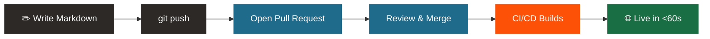

---
hide:
  - toc
  - navigation.footer
---

# Did you know there's a more efficient way to manage and share project documentation?

Replace scattered Word docs, outdated SharePoint pages, and version confusion with a
**single searchable portal** — reviewed like code, deployed in under 60 seconds, and always current.

[See the Live Demo](before.md){ .md-button .md-button--primary }
[Get Started](framework/index.md){ .md-button }

---

## The Problem

-   :material-close-circle:{ .lg .middle style="color:#c0392b" } **Scattered Word docs or PDFs**

    ---
    Files emailed around, saved to desktops, duplicated across shared drives.  
    No one knows which copy is authoritative.

-   :material-clock-alert:{ .lg .middle style="color:#c0392b" } **Outdated SharePoint pages**

    ---
    Last updated two years ago. Half the links are broken.  
    Engineers stop trusting it and ask colleagues instead.

-   :material-file-multiple:{ .lg .middle style="color:#c0392b" } **Version confusion**

    ---
    Four copies of the architecture doc.  
    One named `System_Architecture_v3_John_edits_PLEASE_USE_THIS.pdf`.

-   :material-account-question:{ .lg .middle style="color:#c0392b" } **Tribal knowledge**

    ---
    "Just ask Sarah" — if she's not in a meeting.  
    Runbooks that have never been tested in production.

> *"I can never find anything. Where do we even keep our docs?"*  
> — Engineering Lead, Architecture Review Q1 2024

---

## The Solution

-   :material-language-markdown:{ .lg .middle style="color:#1E6B8C" } **Markdown as Code**

    ---
    Write docs alongside source code with **built-in version control**.  
    Any editor, any OS, zero vendor lock-in.

-   :material-pipe:{ .lg .middle style="color:#1E6B8C" } **Automated Pipelines**

    ---
    GitHub Actions **automatically builds and publishes** on every commit.  
    From merge to live site in under 60 seconds.

-   :material-book-open-page-variant:{ .lg .middle style="color:#1E6B8C" } **MkDocs Portal**

    ---
    A clean, **searchable documentation portal** with full-text search,
    tag taxonomy, and structured navigation — out of the box.

-   :material-source-pull:{ .lg .middle style="color:#1E6B8C" } **PR-Reviewed**

    ---
    Documentation changes go through the same **pull request workflow** as code.  
    Quality enforced by default — no more stale or unreviewed docs.

---

## End-to-End Pipeline

---

## Why It Matters

-   :material-check-circle:{ .lg .middle style="color:#1a6e43" } **Always up-to-date**

    ---
    No more "which version is correct?" — docs are tied to every code release automatically.

-   :material-check-circle:{ .lg .middle style="color:#1a6e43" } **Easy to maintain and collaborate on**

    ---
    Same PR workflow as code review. Engineers already know how to contribute.

-   :material-check-circle:{ .lg .middle style="color:#1a6e43" } **Professional, searchable portal**

    ---
    Full-text search, tag taxonomy, structured navigation — all included.  
    No Ctrl+F through PDFs.

-   :material-check-circle:{ .lg .middle style="color:#1a6e43" } **Platform flexibility**

    ---
    Deploy to Azure, AWS, GCP, or GitHub Pages.  
    Switch targets with a single config change.

---

## Deployment Options

-   :material-microsoft-azure:{ .lg .middle style="color:#0078D4" } **Azure**

    ---
    [Azure Static Web Apps](deployment/azure.md) — global CDN, free tier, custom domains, automatic HTTPS.

-   :material-aws:{ .lg .middle style="color:#FF9900" } **AWS**

    ---
    [S3 + CloudFront](deployment/aws.md) — enterprise scale, fine-grained IAM, geographic restrictions.

-   :material-google-cloud:{ .lg .middle style="color:#4285F4" } **GCP**

    ---
    [Cloud Storage](deployment/gcp.md) — scalable static hosting backed by Google's global network.

-   :material-github:{ .lg .middle } **GitHub Pages**

    ---
    [GitHub Pages](deployment/github.md) — zero config, built-in free hosting, deploys with one command.

