---
tags:
  - Showcase
  - Diagrams
  - Mermaid
---

# Diagrams

All Mermaid diagram types rendered live with this framework's brand colours.

---

## Flowchart — Left to Right

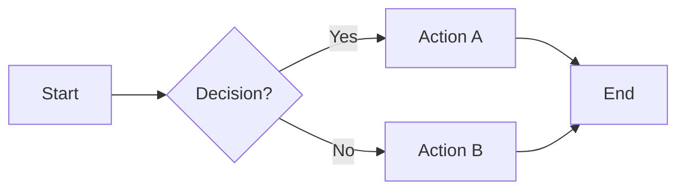

---

## Flowchart — Top to Bottom

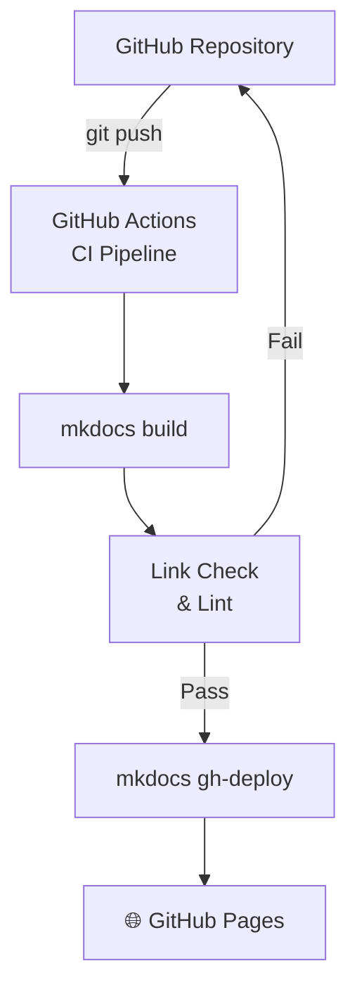

---

## Sequence Diagram

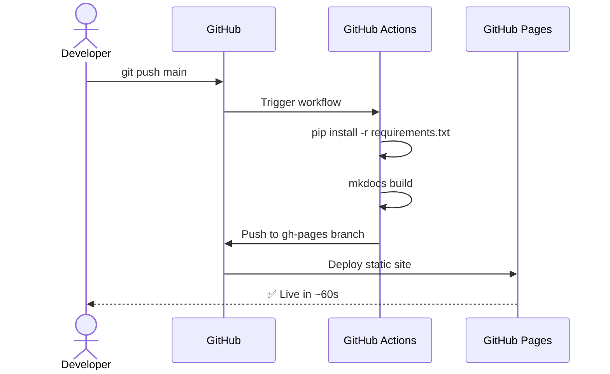

---

## Class Diagram

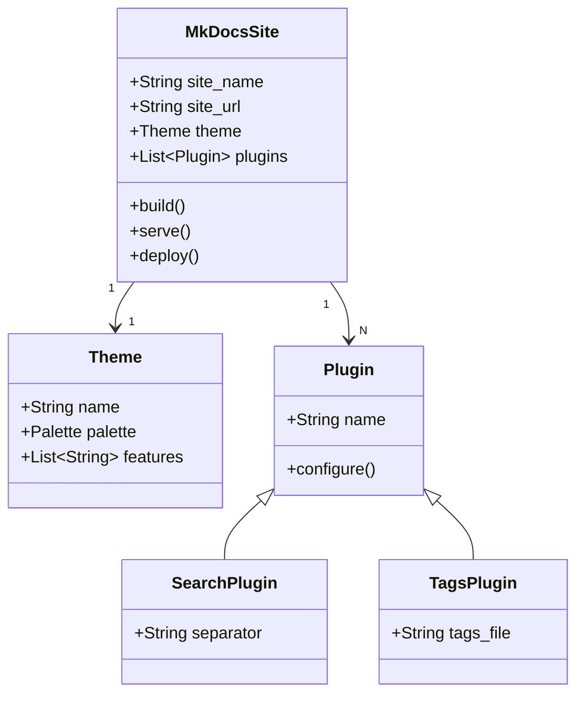

---

## State Diagram

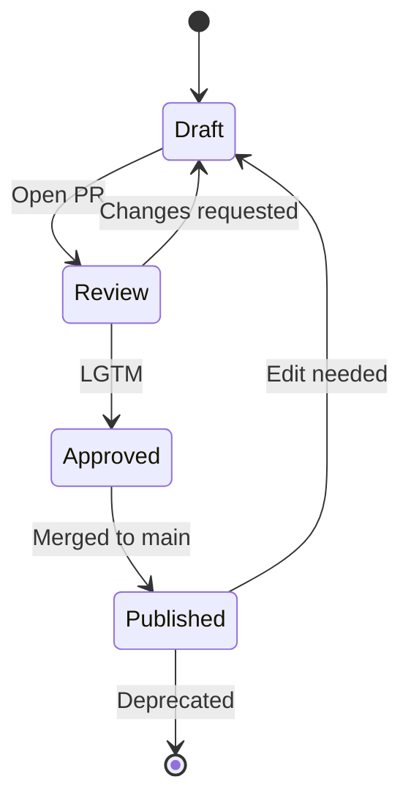

---

## ER Diagram

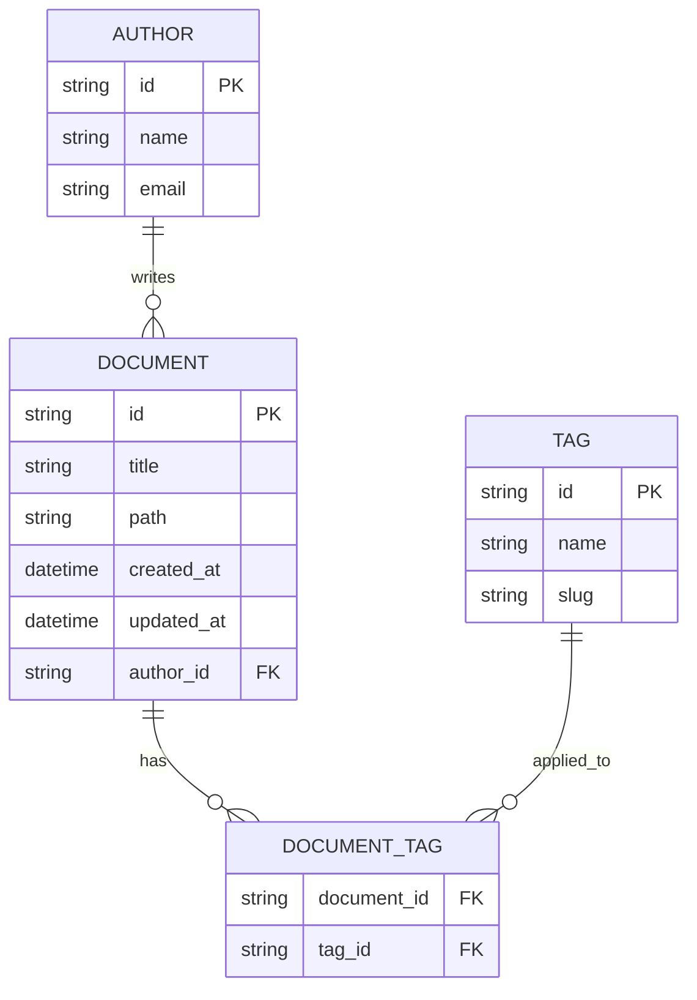

---

## Gantt Chart

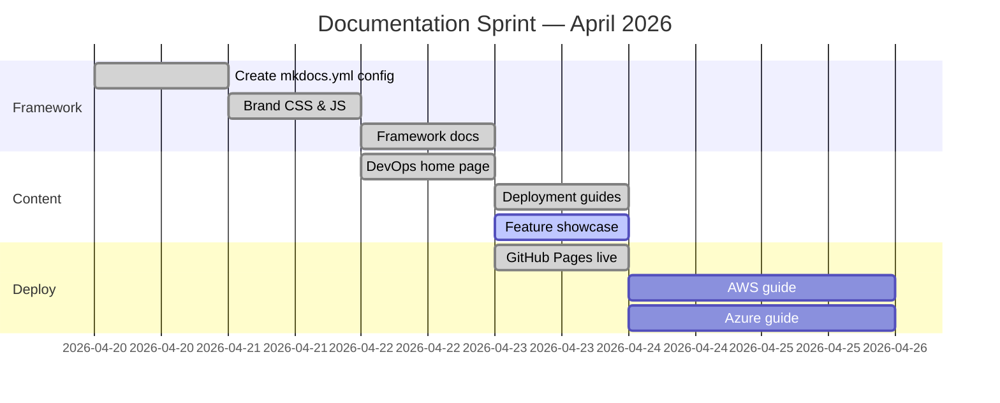

---

## Pie Chart

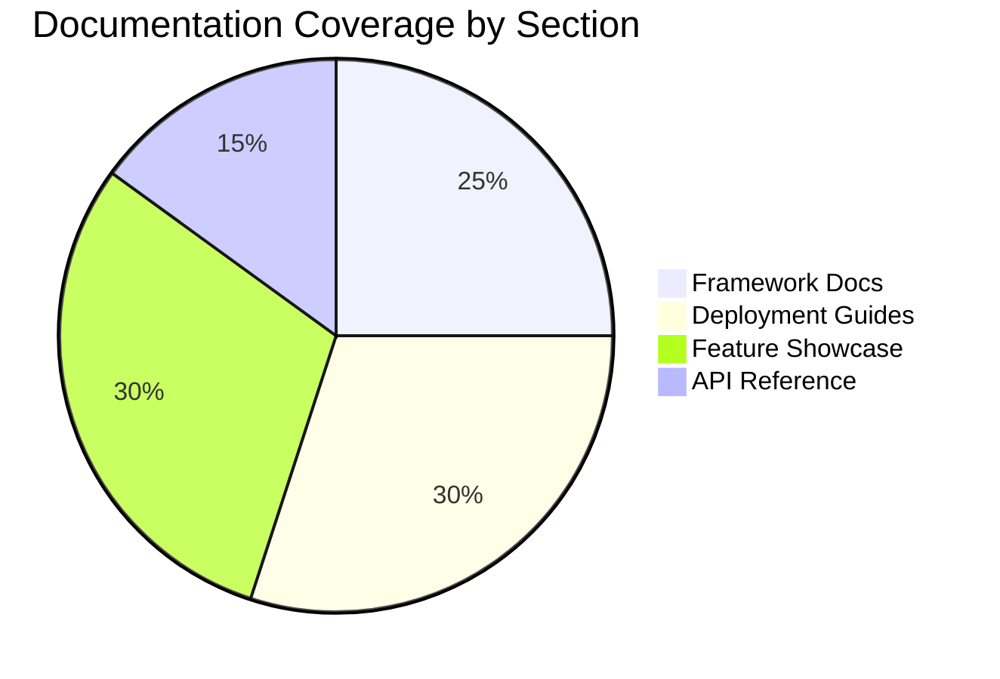

---

## Timeline

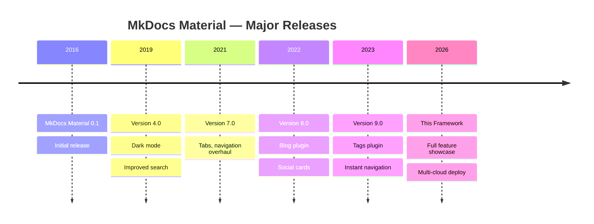

---

## Quadrant Chart

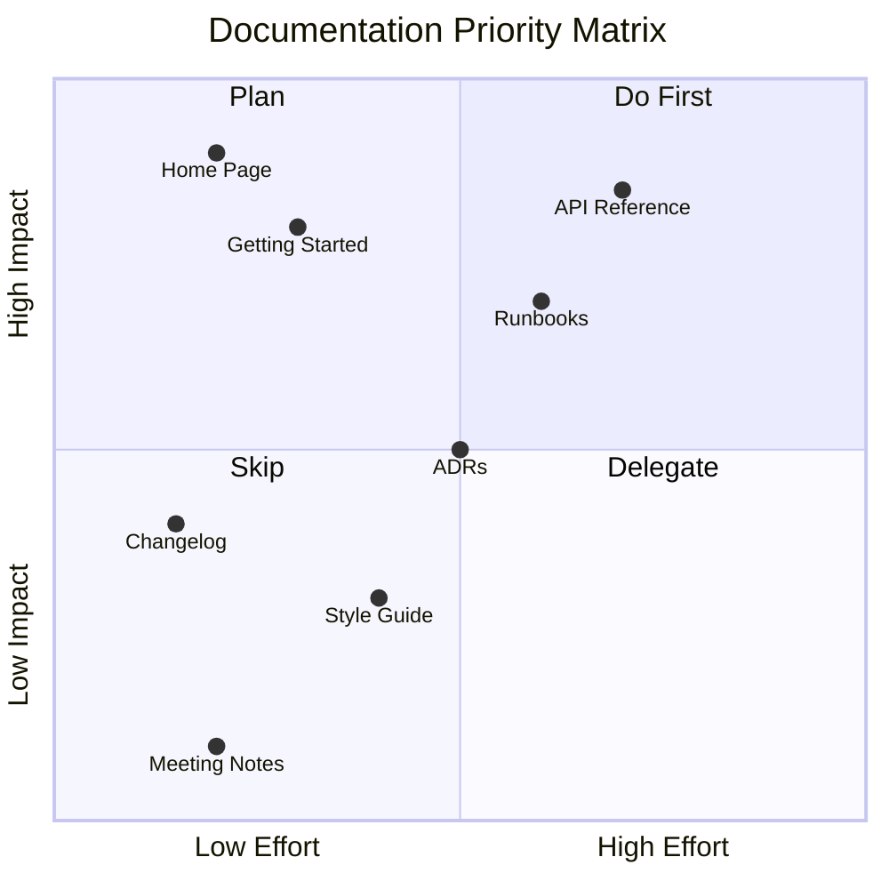

---

## Git Graph

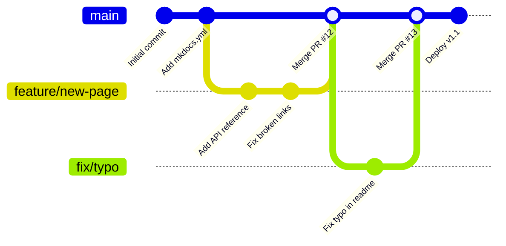

---

## Syntax Reference

````markdown
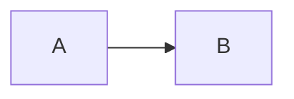
````

All diagram types: `graph`, `sequenceDiagram`, `classDiagram`, `stateDiagram-v2`, `erDiagram`, `gantt`, `pie`, `timeline`, `quadrantChart`, `gitGraph`, `xychart-beta`, `block-beta`.

Full reference: [mermaid.js.org/syntax](https://mermaid.js.org/syntax/flowchart.html)
